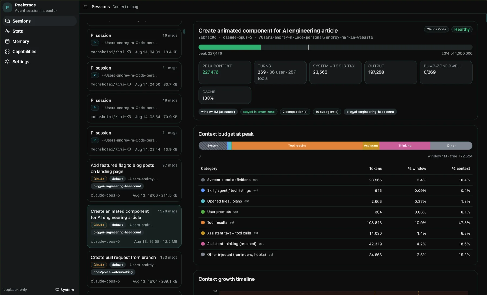
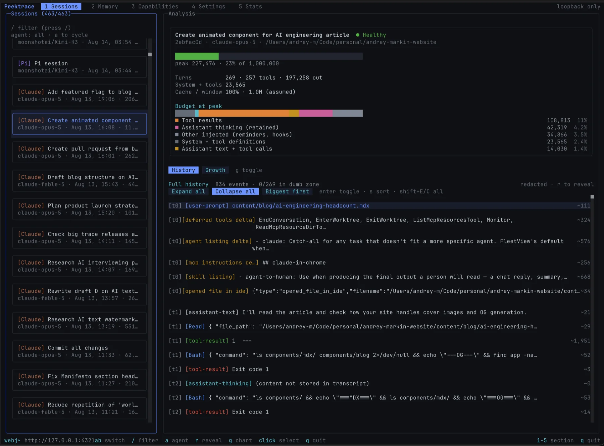
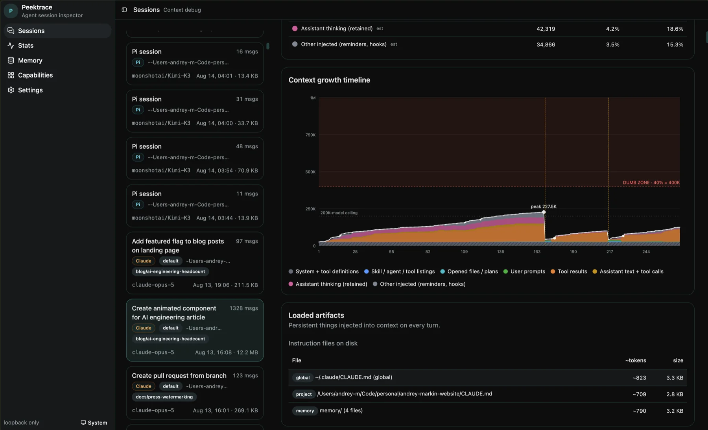
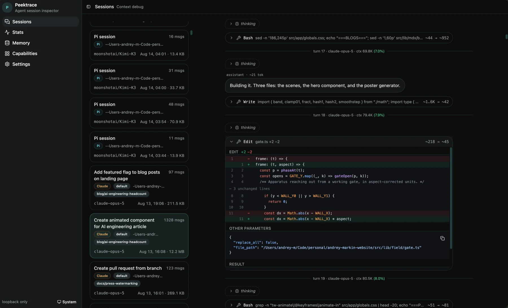
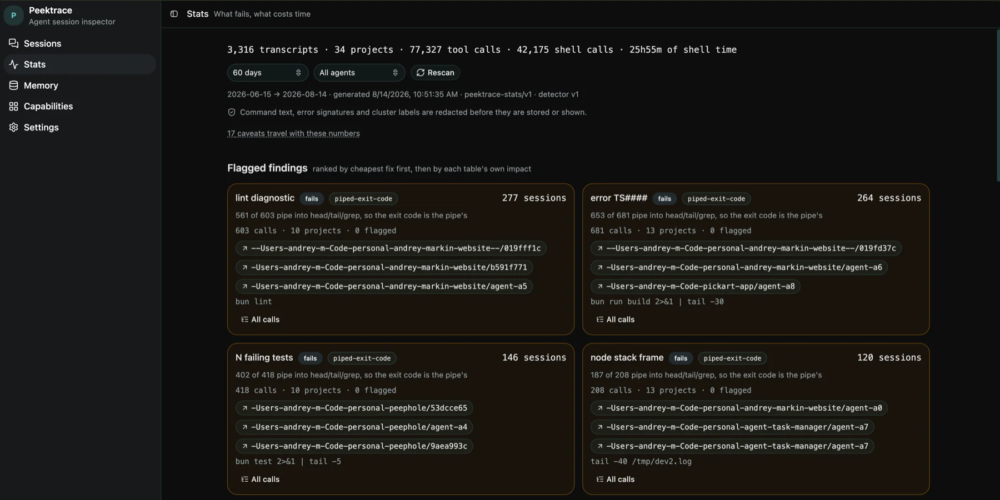
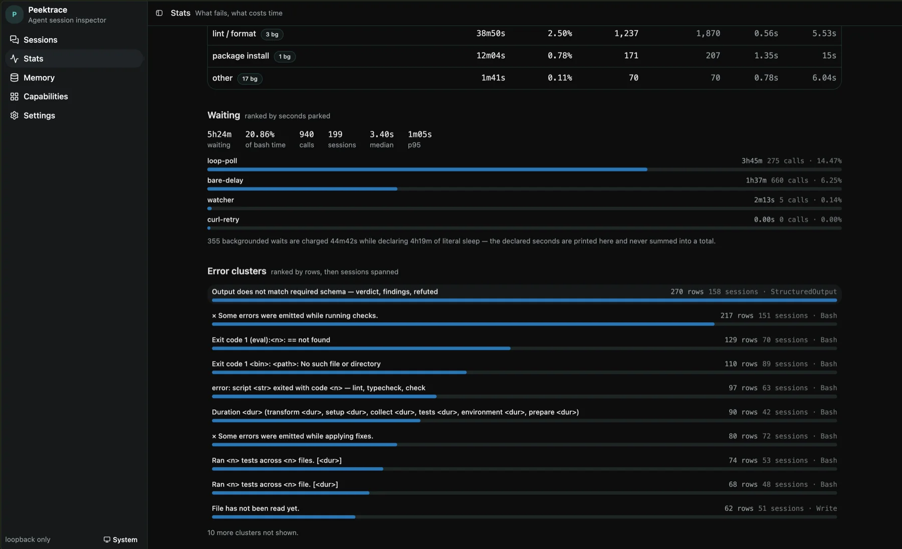
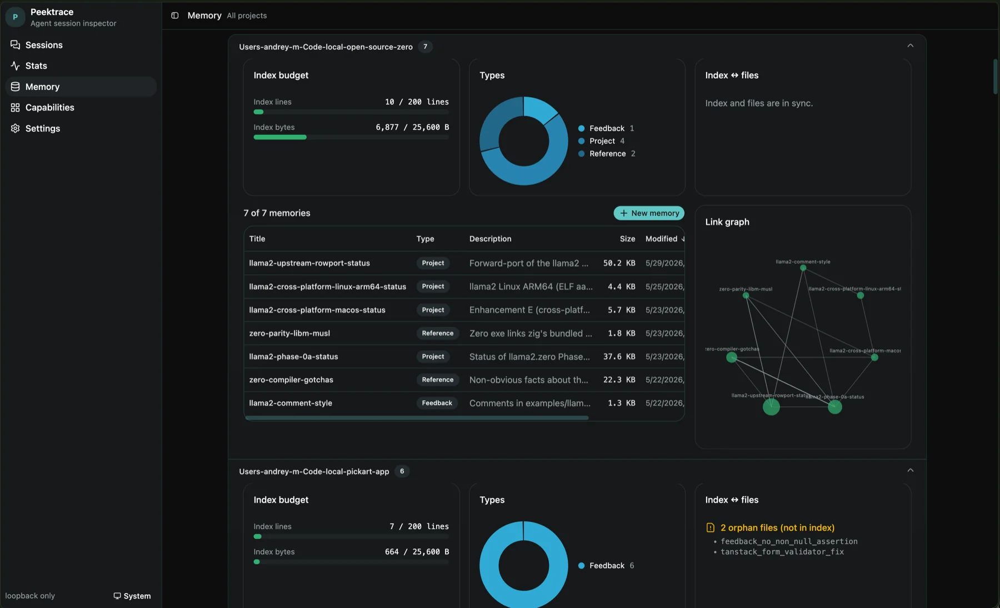

# Peektrace

**See what your coding agent actually put in its context window.**

Peektrace reads the sessions and memories that Claude Code, Codex and Pi scatter
across your disk, and shows you where the tokens went: what the model was
carrying at peak, when a session crossed into the dumb zone, which tool calls
failed, and how much wall-clock time went to waiting.

It runs on `127.0.0.1`, reads your files, and sends nothing anywhere.



```sh
curl -fsSL https://raw.githubusercontent.com/Mark-Life/peektrace/main/scripts/install.sh | sh
peektrace serve
```

---

# Use

## Install

The native installer is the only distribution channel. It pulls a prebuilt
standalone binary from GitHub Releases with the inspector embedded, verifies its
SHA-256, and needs no Node and no build step:

```sh
# macOS / Linux
curl -fsSL https://raw.githubusercontent.com/Mark-Life/peektrace/main/scripts/install.sh | sh
```

```powershell
# Windows (PowerShell)
irm https://raw.githubusercontent.com/Mark-Life/peektrace/main/scripts/install.ps1 | iex
```

It installs to `~/.local/bin` (macOS/Linux) or `%LOCALAPPDATA%\peektrace\bin`
(Windows) and prints PATH guidance if needed. Pin a version with
`PEEKTRACE_VERSION=cli-v1.2.3` (`$env:PEEKTRACE_VERSION` on Windows);
`PEEKTRACE_INSTALL_DIR` overrides the target directory. Later, `peektrace
upgrade` replaces the binary in place, and `peektrace upgrade --check` only
reports whether a newer release exists.

Binaries cover macOS (arm64, x64), Linux (x64, arm64) and Windows (x64). The
Linux builds link glibc — on musl (Alpine) or anything else, build from source.

Peektrace is not on npm, and there is no desktop download yet. Anything claiming
otherwise under the name `peektrace` is not published by this project.

## Two front ends

`peektrace serve` starts the loopback server and opens the web app.

`peektrace tui` does the same but drives a terminal UI, with the web app served
alongside it on the same port. Pass `--no-open` to skip the browser.



Both read the same data through the same in-process core, so you can switch
between them mid-investigation.

On a headless box, `peektrace serve --host 0.0.0.0 --port <p>` binds every
interface. **There is no auth — firewall it yourself.** The default is loopback
only.

## Sessions

Browse Claude, Codex and Pi sessions, filter by agent, then open one for the
full context-budget breakdown: peak context against the window, the partition at
peak including the hidden **thinking** band, a growth timeline marking the
dumb-zone crossing and every compaction cliff, the artifacts injected on each
turn, and searchable history.



Codex reports its context window authoritatively; for Claude it is inferred, and
subagents fold into their parent session. History reads either as a table or as
a chat, with per-turn context and inline diffs.



Transcripts are secret-redacted by default. The reveal toggle is deliberate and
per-session.

## Stats

Rank what fails and what costs time across every session on the machine, not one
at a time. Findings come sorted by cheapest fix first — the run below caught 561
of 603 lint invocations piping into `head`, so the exit code belonged to the pipe
and every failure read as a pass.



Underneath sit shell time by job type, error signatures grouped by shape, and a
waiting panel that separates real work from parked polling.



Command text, error signatures and cluster labels are redacted before they are
stored or shown. Every number ships with its caveats.

```sh
peektrace stats [--days 60] [--agent claude|codex|pi|all] [--limit 20]
peektrace stats refresh [--force]        # rescan and rebuild the cache
peektrace stats drill --fail <key>       # expand one row
```

## Memory

View, create, edit and delete Claude Code memories across all projects, with
per-project drill-in. Alongside the CRUD sits the forensic surface: a `MEMORY.md`
budget gauge against the 200-line / 25 KB cliff with below-fold entries flagged
`INVISIBLE TO CLAUDE`, a type donut, an index ↔ files diff that catches orphans,
and a `[[wikilink]]` graph.



Writes go back to disk atomically — temp file plus rename, compare-and-swap on
mtime.

## Capabilities

A feature × agent matrix for Claude, Codex, Pi and OpenCode. Click a cell to see
why a capability is supported, partial, planned or unsupported. Session browsing
is live for Claude, Codex and Pi; memory tooling is Claude-only; OpenCode is a
column that shows the gap.

## Scripting

The same binary exposes one-shot commands, in-process or `--remote <url>`
against a running server. Root flags go **before** the subcommand: `--json`
(raw JSON instead of tables), `--pretty` (aligned instead of tab-separated),
`--read-only` (refuse mutating commands), `--remote <url>`, `--otel`,
`--no-telemetry`.

```sh
peektrace sessions ls [--project <slug>]
peektrace sessions analyze <session-id>
peektrace memory ls [project]                    # --json for raw output
peektrace memory show <project> <name>
peektrace --read-only memory rm <project> <name> # refused, nothing written
peektrace doctor                                 # write a local support bundle
```

`peektrace doctor` collects recent local run-log events, recursively redacts
them, and writes a JSON bundle to `~/.peektrace` (or `PEEKTRACE_DIR`) for you to
email. It is a diagnostics export, not a health check — nothing is uploaded.

Full flag reference: [`apps/cli/README.md`](apps/cli/README.md).

## Desktop app

`apps/desktop` wraps the same binary in an Electron shell — native window,
single-instance lock, auto-update from GitHub Releases — spawning the binary as a
loopback sidecar and loading its URL.

It is **not distributed yet**. The workflow is manual-dispatch only until builds
can be signed and notarized; Mac builds are currently unsigned (right-click →
Open on first launch). Plan: `.docs/plan/desktop-app.md`.

## Privacy posture

- **Loopback only.** The server binds `127.0.0.1`. Nothing is exposed off-box.
- **Secret redaction on by default** for every rendered or exported transcript.
- **No model ever sees your data.** The core reads bodies itself; no transcript
  and no memory is sent to an LLM.
- **Safe writes.** Atomic temp-write plus rename, compare-and-swap with a
  per-file lock, and a compile-time read-only filesystem layer behind
  `--read-only`. Editing is enabled only where the capability registry says the
  agent supports it.
- **Local run log, on by default, never sent anywhere.** Each invocation appends
  one wide event to a SQLite file under `~/.peektrace` (or `PEEKTRACE_DIR`). It
  makes no network calls. Opt out with `--no-telemetry` or
  `PEEKTRACE_NO_TELEMETRY=1`. `peektrace doctor` is the only way this data leaves
  your machine, and only if you email the redacted bundle yourself.
- **One outbound call, at startup.** `peektrace serve` fires a best-effort,
  non-blocking GET at the GitHub releases API to see whether a newer `cli-v*`
  exists, and prints one hint line if so. The result caches for ~24h, so it hits
  the network at most once a day, and it never delays the server. It sends
  nothing about you. Disable with `PEEKTRACE_NO_UPDATE_CHECK=1`.

---

# Develop

## Prerequisites

- **[Bun](https://bun.com/docs/installation)** `>=1.3.0` — runtime and package
  manager.
- **Node.js** `>=20.9.0` — required by some workspace tooling.

## Run from source

```sh
bun install
bun run serve      # build the inspector, then serve on 127.0.0.1
bun run tui        # same, into the terminal UI
```

Both scripts build `apps/inspector` first. To skip the rebuild and pass flags
straight through:

```sh
bun run --filter=inspector build          # emit apps/inspector/dist once
bun run apps/cli/src/index.ts serve --port 4321
```

Dev vs prod transport is explained in
[`apps/inspector/README.md`](apps/inspector/README.md).

## Layout

| Path | Role |
| --- | --- |
| `packages/core` | Effect services: agents · capabilities · sessions · memory · stats · fs · watch |
| `packages/rpc` | Effect-RPC contract, handlers, typed client |
| `packages/viz` | Shared chart primitives |
| `packages/ui` | shadcn/ui component library |
| `apps/cli` | the `peektrace` binary: one-shot commands, `serve`, `tui` |
| `apps/inspector` | Vite + React + Effect-Atom web UI |
| `apps/desktop` | Electron shell around the compiled binary |
| `apps/web` | Next.js marketing site, independent of the inspector |

`apps/web` and its oRPC `packages/api` are a separate concern from Peektrace
itself. The site runs behind [portless](https://portless.sh) at
`https://web.localhost:8443` — automatic HTTPS on an unprivileged port, so it
never needs `sudo`. For plain `http://localhost:3000`, run `bun run dev:app` in
`apps/web`.

## Commands

| Command | Description |
| --- | --- |
| `bun dev` | Start all apps in dev mode |
| `bun run build` | Build every app and package |
| `bun run typecheck` | `tsc --noEmit` per package |
| `bun run check` | Lint and format check (Ultracite / Biome) |
| `bun run fix` | Auto-fix lint and formatting |
| `bun run desktop:dev` | Run the Electron shell unpackaged |
| `bun run desktop:package` | Build an unsigned macOS `.dmg` |

Typecheck with `bun run typecheck` only. Never `tsc -b` or bare `tsc` — build
mode emits `.js` and `.d.ts` next to sources and pollutes the tree.

Add shadcn components to the shared package, then import from `@workspace/ui`:

```sh
bunx shadcn@latest add button -c packages/ui
```

## Editor setup

Open the repo in VS Code or Cursor and accept the recommended extensions
(`.vscode/extensions.json`): Biome as the default formatter, Tailwind
IntelliSense inside `cn` / `cva` / `tv`, the Bun debugger, and Pretty TypeScript
Errors. Format-on-save, import organization and lint auto-fix run through Biome
on every save; `.editorconfig` covers other editors.

## Release

`apps/cli` compiles to a standalone executable with the inspector embedded:

```sh
bun run --filter=peektrace build:binary
```

The result serves with zero external files. CI publishes it on `cli-v*` tags,
feeding the installers in `scripts/`. The same binary is the sidecar inside the
undistributed desktop app.

---

## Author

**[Andrey Markin](https://andrey-markin.com)**
([@Mark-Life](https://github.com/Mark-Life)).

## License

[MIT](LICENSE) © Mark-Life Ltd and Andrey Markin. The licence sits at the repo
root and covers the whole workspace — every package under `packages/` and
`apps/`, and the standalone `peektrace` binary built from `apps/cli`.
